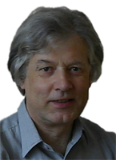

Jiří Šrajer urodził się w Opawie w Czechach w 1950 roku.
Studiował matematykę na Uniwersytecie im Karola w Pradze.
Od ponad 30 lat pracuje jako informatyk w różnych firmach
(jako programista, analityk albo administrator).
Od 1988 roku mieszka na stałe w Polsce.
Współzałożyciel i wieloletni prezes Stowarzyszenia Programistów i Nieprogramistów SPIN w Biskupcu,
które między innymi zajmowało się wykorzystaniem sztucznej inteligencji w grach logicznych
i organizowało turnieje programów komputerowych.
Po napisaniu książki PRAWDOPODOBNIE WSZYSTKO JEST INACZEJ
rozpoczął intensywne prace nad geometrią czasoprzestrzeni.
