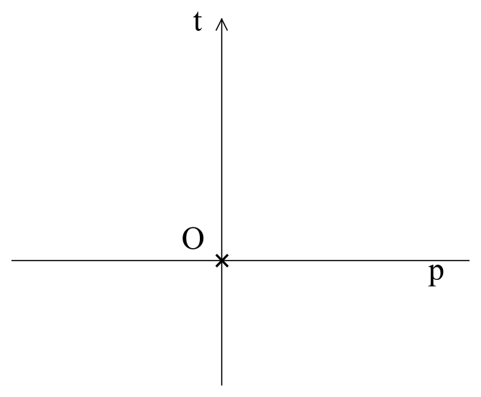
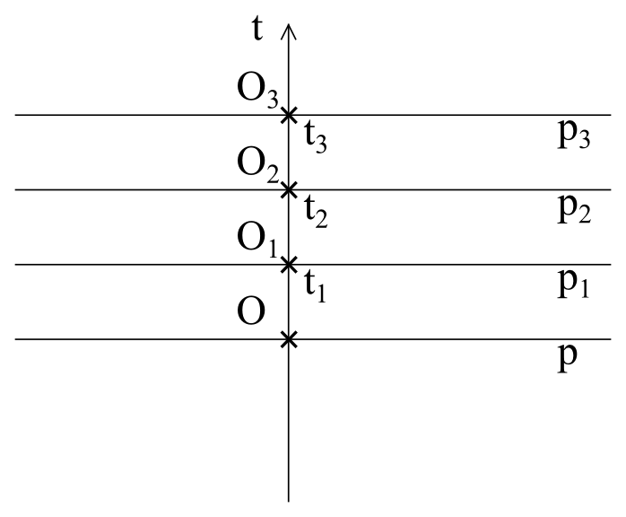
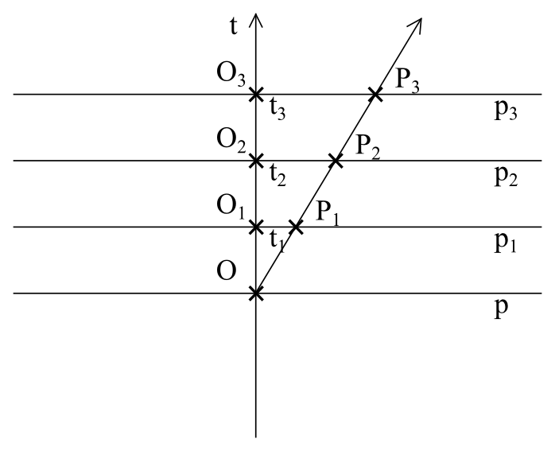
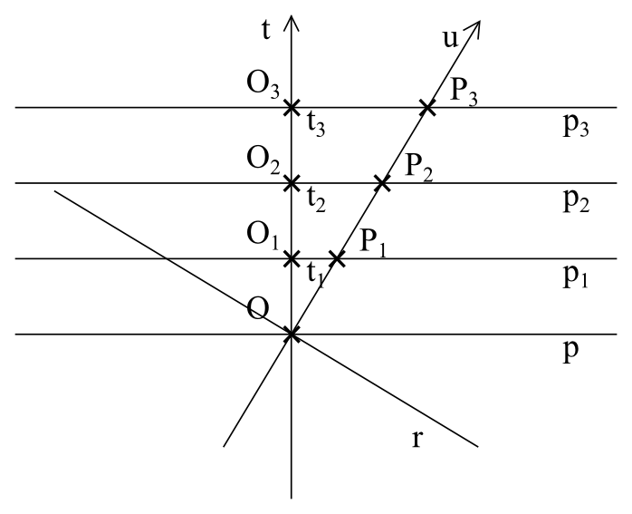

## X. Zasada względności w czasoprzestrzeni

Do analizy warto zawsze wybrać na początku najprostszy model.
Dlatego nasze rozważania rozpoczniemy od jednowymiarowej przestrzeni, którą możemy sobie wyobrażać,
jako prostą **p**, w której mamy nieruchomego obserwatora **O**.
Jeżeli dodamy czas, jako prostą **t** ortogonalną do przestrzeni **p**, to otrzymamy dwuwymiarową czasoprzestrzeń (rys. 8).
...<!--

Rysunek 8

Zakładamy, że nasz obserwator nie rusza się w przestrzeni (czy dokładniej:
nie rusza się względem systemu współrzędnych, który jest z nim powiązany),
to znaczy, że w czasoprzestrzeni będzie poruszać się tylko w kierunku osi **t**
i w kolejnych chwilach **t1**, **t2**, **t3** będzie znajdował się w punktach
**t1**, **t2**, **t3** na osi **t** (rysunek 9).

Rysunek 9

Dodajmy do naszego modelu jeszcze jedneg1o obserwatora P,
który będzie się od obserwatora O oddalać ruchem prostoliniowym jednostajnym.
Jego tor w czasoprzestrzeni będzie tworzył prostą nachyloną względem osi czasu obserwatora O
pod pewnym kątem, zależnym od szybkości, jaką się obserwator P oddała od obserwatora O (rysunek 10).

Rysunek 10

Zasada względności mówi nam jednak, że ruch jest względny.
Jeżeli mamy dwóch obserwatorów, którzy od siebie się oddalają, nie da się stwierdzić,
który jest w spoczynku a który w ruchu. To znaczy, że obserwator P może twierdzić,
że to on nie rusza się w przestrzeni a obserwator O oddała się od niego.
Dla niego czas płynie w kierunku jego ruchu w czasoprzestrzeni,
czyli wzdłuż linii **u** a przestrzeń przebiega dla niego w kierunku linii **r** (rysunek 11).

Rysunek 11

Jeżeli trzymamy się zasady względności, to sytuacja obserwatora O i obserwatora P musi być analogiczna.

Ze względu na to, że całą operację możemy powtarzać rozpoczynając od obserwatora P
i prędkość oddalania się następnego obserwatora możemy zmieniać, wydaję się,
że w naszej czasoprzestrzeni może przestrzeń i czas przebiegać w dowolnym kierunku.
Ponieważ światło dla każdego obserwatora musi poruszać się tak samo, oznacza to,
że rozprzestrzenia się z tą samą szybkością we wszystkich kierunkach czasoprzestrzeni
i że dla światła nie istnieje czas.

Od razu jednak widać kilka problemów. Na przykład co to właściwie jest szybkość światłą,
jeżeli dla światła nie płynie czas i cała czasoprzestrzeń dla niego oznacza tylko przestrzeń.
Albo jeszcze poważniejszy problem dotyczący przyczynowości.
Jeżeli kierunek czasu w czasoprzestrzeni  może być dowolny,
to dla dwóch różnych obserwatorów może biec w przeciwnym kierunku.
To naruszałoby przyczynowość. W tym miejscu musimy w naszych rozważaniach zatrzymać się i pomyśleć,
gdzie jest błąd i które nasze założenia trzeba zmienić.

Znalezienie rozwiązania często bywa trudne właśnie dlatego, że niektóre założenia przyjmujemy nie świadomie.
Jesteśmy nauczeni i przyzwyczajeni do pewnych poglądów  i wcale o nich nie myślimy jako o założeniach.
Także nie jest łatwo wpaść na to, że problem z przyczynowością może być spowodowany tym,
że piszemy i rysujemy na płaskiej kartce papieru i że w wyniku tego nasz model jest plaski.
Tylko jeżeli nie płaski, to jaki?
Pierwszym pomysłem jest, że płaszczyznę zaczniemy zginać i zrobimy z niej powierzchnię kuli.
Tylko że kula nie tylko nie rozwiązuje problemu, ale jeszcze stwarza następny:
co się stanie, jeżeli obserwator obiegnie w czasie całą kulę i powróci do miejsca,
w którym był na początku? Wszystkie tę problemy jednak znikną, jeżeli kula zacznie się rozszerzać.
Otrzymamy inne wyobrażenie o czasie. Czas tu ma dwa wymiary.
Czas lokalny, różny dla różnych obserwatorów, który w zależności od szybkości ma różny kierunek
w czasoprzestrzeni i czas kosmiczny w kierunku rozszerzania się czasoprzestrzeni,
który w danym punkcie jest jednakowy dla wszystkich obserwatorów i dotyczy także światła.
W takim modelu nie jest naruszona zasada przyczynowości,
bo chociaż czas lokalny dwóch obserwatorów płynie w odwrotnym kierunku, to czas kosmiczny powoduje,
że kolejność zdarzeń jest zachowana.

## [XI. Zespolony czas i interwał czasoprzestrzenny ](rozdzial11) -->
