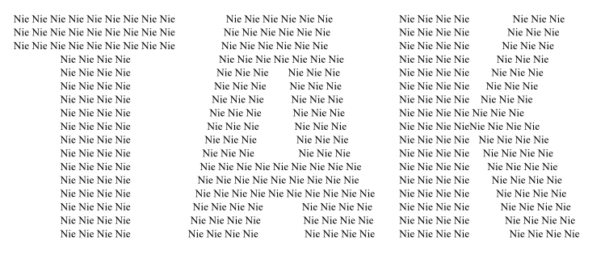

## XIII. Zakończenie

Rzeczywistość zawsze jest bogatsza niż jakikolwiek model.
W celu jak najlepszego odzwierciedlenia rzeczywistości modele stają się coraz bardziej rozbudowane
i używany aparat matematyczny jest na tyle skomplikowany, że oprócz specjalistów w danej dziedzinie nikt go nie rozumie.
Jednak zrozumienie jakiegoś modelu nie oznacza zrozumienia rzeczywistości.
Równania nic nie mówią o tym, w jaki sposób mamy interpretować wyniki obliczeń.

Przykładem nietypowej dla nas interpretacji wyniku obliczeń jest historia opisana przez Marcela Graneta
w jego książce "La pensée chinoise". Opisuje legendę, w której generałowie zastanawiali się przed bitwą,
czy przypuścić atak, czy też się wycofać. Nie mogąc się zdecydować, postanowili głosować.
Okazało się, że trzech z nich opowiada się za atakiem, ośmiu zaś za odwrotem.
Wydawałoby się, że wynik trzeba zinterpretować tak, że trzeba się wycofać.
A jednak w wyniku tego głosowania generałowie postanowili zaatakować,
bo liczba "trzy" dla nich była liczbą wyrażającą jednomyślność. Zaatakowali i odnieśli zwycięstwo.

Fakt, że coś obliczymy jeszcze nie oznacza, że wiemy jak to interpretować.
Rzeczywistość nie jest czarno-biała i jednoznaczna.
Przy podejmowaniu jakiekolwiek decyzji postępujemy według jakiegoś uproszczonego schematu,
i zależy, jakie szczegóły są dla nas w danej chwili ważne.
Na podstawie tego, co jest napisane poniżej, decydujemy się na **TAK** czy **NIE**?

Bez względu na inne czynniki, ważne jest to, z jakiej odległości patrzymy.

W przypadku małych odległości możemy uważać, że światło porusza się z nieskończoną prędkością,
że wszystko jest takie, jakim to widzimy. Przy tym założeniu możemy uważać, że wokół siebie widzimy trójwymiarową przestrzeń.

Jeżeli oglądamy obszary na tyle oddalone, że światło od nich do nas dochodzi z zauważalnym opóźnieniem,
wtedy nie oglądamy przestrzeni, tylko różne części czasoprzestrzeni.
Interpretacja tego, co widzimy nie jest wynikiem obliczeń, tylko naszych przemyśleń...

## [Literatura](literatura) 
