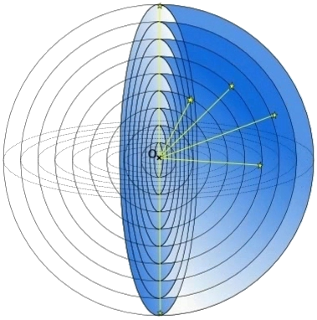
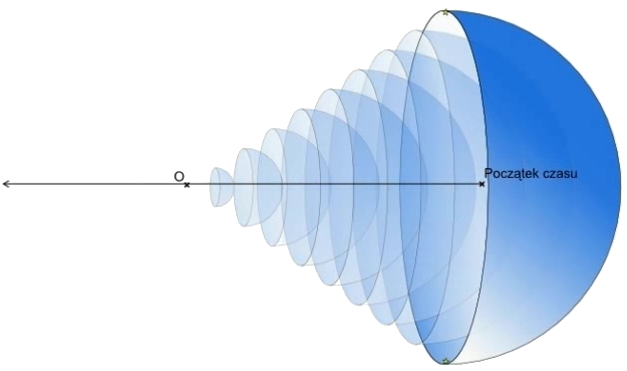
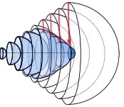
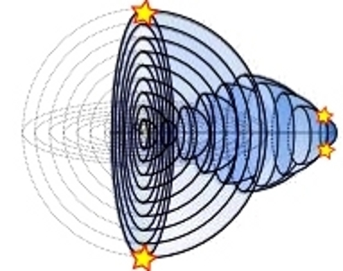
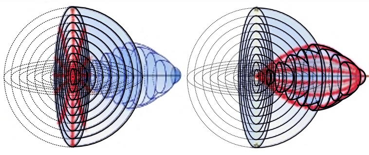

## II. Widzialna część Wszechświata

*To, że w ogóle mamy jakieś informacje o kosmosie zawdzięczamy temu, że kosmos jest wypełniony różnymi falami.
Obraz wszechświata budujemy tylko na podstawie fal, które docierają do nas i które potrafimy zarejestrować.
Na podstawie doświadczenia z małych odległości uważamy, że widziane obiekty znajdują się w kierunku,
z którego do nas dochodzi od nich światło i w odległości równej torowi światła od obiektu do nas.
Jednak nie zawsze to musi być prawda ...*

Moje rozważania na temat geometrii wszechświata rozpoczęły się od następujących uwag:

Ze względu na skończoną szybkość światła nie widzimy obiektów na niebie takimi, jakimi są w tej chwili,
tylko jak wyglądały jakiś czas temu. Słońce widzimy tak, jak wyglądało około 8 minut temu,
najbliższe gwiazdy kilka lat temu a oddalone galaktyki miliardy lat temu.
Najbardziej oddalone od nas obiekty są najstarsze.
Można sobie wyobrazić, że znajdują się na ogromnej sferze o promieniu wielu miliardów lat świetlnych.

Jednak, jeżeli wszechświat na początku był mały, to ta najstarsza sfera nie może być duża.
Nie ma to specjalnego znaczenia, czy na tej fikcyjnej sferze znajdują się jakieś konkretne obiekty
czy też nie, nawet to, czy w ogóle już wtedy było światło.
Jeżeli wszechświat na początku znajdował się w jednym punkcie, to dla nas ten punkt znajduje się najdalej
ze wszystkiego. I to co jest najdalej od nas, wydaje nam się być ogromną sferą ...

Jak wytłumaczyć, że coś małego wydaję nam się tak ogromne? W pierwszej chwili zdaje się to być absurdalne.
Jak cały wszechświat może być wewnątrz małej sfery, czy nawet jednego punktu? 

*Zanim pójdziemy dalej, zróbmy następujący eksperyment myślowy.
Wyobraźmy sobie, że na powierzchni kuli ziemskiej są rozmieszczone światełka i do każdego z nich
jest pociągnięty światłowód wzdłuż południków.
My siedzimy w okrągłym pomieszczeniu na biegunie północnym i dookoła mamy ekrany,
na których możemy obserwować wszystkie światełka.
Patrząc przez okno widzimy prosto naciągnięte światłowody, i wyobrażamy sobie,
że każde światełko znajduje się w linii prostej biegnącej w kierunku, w którym podłączony jest światłowód.
Możemy też ustalić długość każdego światłowodu
(na przykład przez wysłanie światłowodem sygnału świetlnego i zaczekanie na jego odbicie).
Tą długość postrzegamy, jako odległość światełka od nas w linii prostej.
Punkty jednakowo od nas oddalone będą leżały na równoleżnikach.*

*Jeżeli będziemy przekonani, że wszystkie światełka znajdują się w jednej płaszczyźnie,
to możemy na kartce papieru narysować odpowiednią mapę.
Poszczególnym równoleżnikom coraz bardziej od nas oddalonym będą odpowiadały koła o coraz większym promieniu.
Kiedy przekroczymy równik, długości równoleżników będą się zmniejszać,
ale promienie okręgów na naszej mapie będą dalej rosły.
Najbardziej odległym punktem, który możemy zobaczyć, jest biegun południowy.
Zobaczymy go w każdym kierunku, w którym popatrzymy i jawi się nam on jako ogromne koło,
które zawiera wszystkie inne punkty ...*

Wróćmy do problemu, jak wyobrazić sobie rozmieszczenie obiektów w czasoprzestrzeni
i ustalić tor światła w rozszerzającym się Wszechświecie. Mój tok myślenia był następujący:

Cały widzialny Wszechświat możemy sobie wyobrazić jakoby poukładany ze sfer wokół nas o coraz większym promieniu.
Im większy promień, tym starsza sfera (rys.1).

Rysunek 1.

Jeżeli dodamy czas jako następny wymiar i każdą sferę umieścimy w odpowiednim czasie,
to sfery utworzą czterowymiarowy stożek (rys.2).

Rysunek 2.

*Jeżeli ktoś ma trudności z wyobrażeniem sobie czterowymiarowego stożka,
może odjąć jeden wymiar i wyobrazić sobie tylko przekrój przez widzialny Wszechświat.
Zamiast sfer, które przetnie w myśli płaszczyzną, otrzyma układ koncentrycznych okręgów w płaszczyźnie,
które po dodaniu czasu, jako następnego wymiaru utworzą zwykły stożek.*

Jeżeli Wszechświat rozszerza się, to przy cofaniu w czasie musi się kurczyć. Sfery najstarsze muszą być małe (rys.3). 

                       

Rysunek 3.

Obiekty, które nam wydają się bardzo od siebie odlegle, mogą być w czasoprzestrzeni blisko siebie (rys.4).

Rysunek 4.

Jeżeli wyobrazimy sobie widzialną część Wszechświata,
jako odpowiednio pomniejszone i rozłożone w czasoprzestrzeni sfery,
to rozwiąże się jednocześnie kilka problemów kosmologicznych.
Jednorodność promieniowania tła przestanie być problemem, jeżeli uświadomimy sobie,
że promieniowanie tła, chociaż dociera do nas ze wszystkich stron z bardzo dużych odległości,
przychodzi z małego obszaru czasoprzestrzeni (rys.5).

Rysunek 5.

Widać, że w obserwowalnym Wszechświecie nie ma obszarów przyczynowo rozłącznych,
bo im są obiekty dalej od nas, tym są bliżej do siebie.
Nie potrzebna jest kosmiczna inflacja,
czyli ogromne zwiększenie rozmiarów Wszechświata w ułamku sekundy,
bo do ogromnego rozciągnięcia najstarszych sfer dochodzi tylko w naszym umyśle.
Zrozumiemy, że jeżeli ktoś wyobraża sobie zagięty obszar czasoprzestrzeni,
jako niezakrzywioną trójwymiarową przestrzeń, to w takiej przestrzeni
oddalone od nas obszary są rozciągnięte podobnie jak obszary na płaskiej mapie globu.
W konsekwencji w takiej przestrzeni pozornie brakuje ogromnej ilości materii i energii ...

Czy z tego, co do tej pory pokazaliśmy, wynika coś dotyczącego geometrii przestrzeni?

Tylko tyle, że na podstawie bezpośrednich obserwacji nie można stwierdzić,
czy przestrzeń jest zakrzywiona czy niezakrzywiona.
To, co sobie wyobrażamy, jako niezakrzywioną trójwymiarową przestrzeń,
jest poskładane z różnych sfer w jakiś sposób rozmieszczonych w czasoprzestrzeni,
które na dodatek widzimy rozciągnięte na różnorakie sposoby.

Założenie, że czas jest liniowy i czasoprzestrzeń można rozumieć,
jako poszczególne przestrzenie chwilowe poukładane obok siebie wzdłuż linii czasu,
nie musi być prawdziwe. Bez względu na to, widzialny Wszechświat można rozumieć, jako system sfer
o różnych parametrach czasowych.

Niezależnie od tego, czy przestrzeń jest zakrzywiona czy płaska, z każdej przestrzeni chwilowej
widzimy tylko i wyłącznie sferę. To nie daje żadnej możliwości ustalenia krzywizny przestrzeni.

Widać jednocześnie, że do uzyskania prawidłowego obrazu Wszechświata należy ustalić
rozmieszczenie obiektów w czasoprzestrzeni. I tu pojawia się kolejny problem.
Jak ustalać odległości w czasoprzestrzeni? W modelach matematycznych używany jest w tym celu
interwał czasoprzestrzenny. Jeżeli spróbujemy użyć go w praktyce, otrzymamy wartość zerową
dla wszystkich obiektów, które w danej chwili widzimy.
Okazuje się, że interwał czasoprzestrzenny w obserwowanym Wszechświecie nie jest odległością
dwóch zdarzeń w czasoprzestrzeni, ale odległością sygnału świetlnego związanego z jednym zdarzeniem,
od drugiego zdarzenia.

Jeżeli chcemy ustalić prawidłowe rozmieszczenie obiektów we Wszechświecie,
to musimy znaleźć bardziej odpowiednią definicję odległości w czasoprzestrzeni.
Zadanie nie jest proste. Aby dobrze zrozumieć problem musimy przeanalizować całą drogę
powstawania pojęcia czasoprzestrzeni i ustalania w niej odległości.
Następnie musimy ustalić, przy jakich założeniach był utworzony interwał czasoprzestrzenny
i które z tych założeń mogą być niewłaściwe. Następnie musimy znaleźć jakieś inne możliwości.
Do tego będziemy potrzebować trochę matematyki. Postaram się zrobić to w jak najłagodniejszej formie.

## [III. Matematyka i mózg](rozdzial3)
