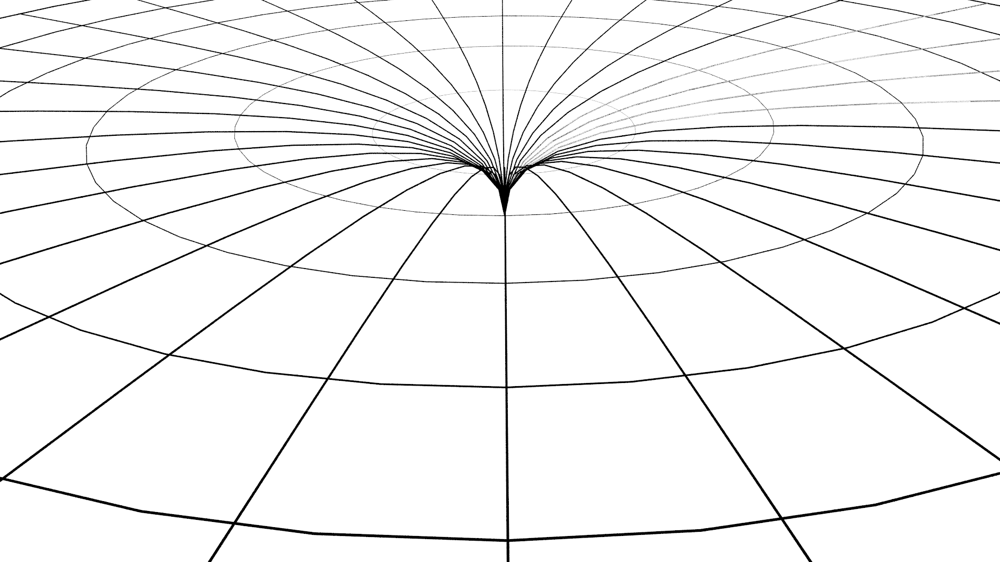
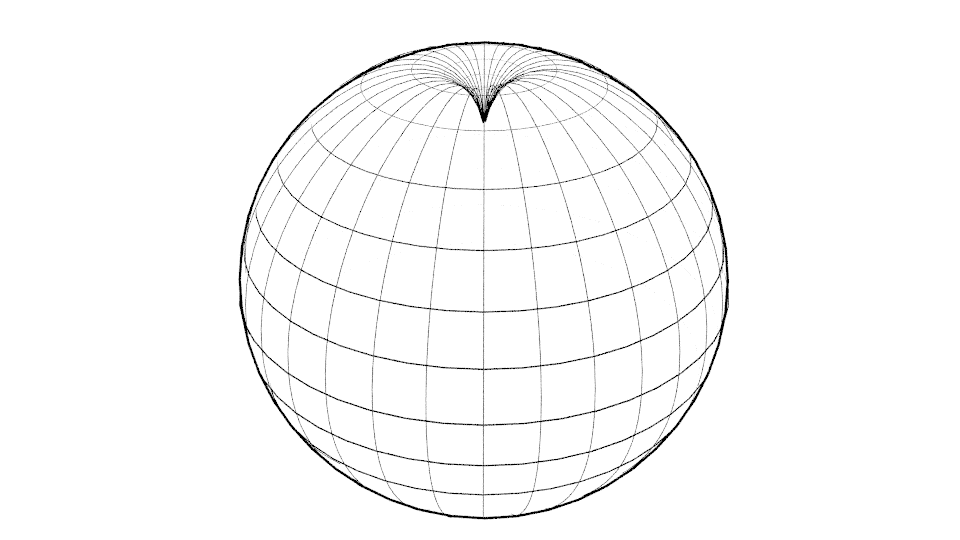

## III. Matematika i mózg

Często ten sam problem można rozwiązywać za pomocą równań matematycznych,
albo geometrycznie. Grawitację można na przykład uznać za siłę i opisać równaniem,
albo tłumaczyć geometrycznie, za pomocą zakrzywienia czasoprzestrzeni.

*Prawdopodobnie nie chodzi tylko o użycie innego narzędzia, ale i innej półkuli mózgu.
Równaniami zajmuje się lewa półkula a prawa wyobraźnią geometryczną.
Dlatego też, dla pełnego zrozumienia warto nie tylko potrafić coś obliczyć,
ale również umieć to sobie wyobrazić.*

Liczby możemy rozumieć, jako abstrakcyjne symbole, albo możemy je sobie wyobrażać,
jako punkty na prostej, tak zwanej osi liczbowej.
Punkt odpowiadający liczbie x znajduje się w odległości x od punktu oznaczonego,
jako zero (w jedną stronę dodatnie, w drugą stronę ujemne).
Jeżeli każdemu punktowi na prostej przyporządkujemy dokładnie jedną liczbę,
to otrzymujemy tak zwane liczby rzeczywiste.

Płaszczyznę możemy połączyć z liczbami na przykład w taki sposób,
że każdy punkt płaszczyzny utożsamiamy z parą liczb rzeczywistych.
Otrzymujemy w ten sposób współrzędne każdego punktu płaszczyzny.

(Łatwo można w ten sposób rozszerzyć geometrię na dowolną ilość wymiarów n, tylko każdy punkt
zamiast parą liczb, będzie zdefiniowany ciągiem n liczb rzeczywistych x=(x1,x2,...,xn).
Jeśli dla każdej pary elementów x i y wprowadzimy pojęcie wzajemnej ich odległości
zdefiniowanej wzorem

$$ d = \sqrt {(y_1-x_1)^2+ ... +(y_n-x_n)^2}  $$,

to otrzymamy przestrzeń euklidesową.)

Różne kształty geometryczne, na przykład prosta albo okrąg, są w takim ujęciu zbiorem par liczb rzeczywistych
spełniających określone równanie. Problemy geometryczne można w ten sposób przekształcić na rozwiązywanie równań,
co z praktycznego punktu widzenia bywa wygodniejsze.

Pozornie wydaje się, że jest obojętne, czy problem rozwiązujemy geometrycznie czy analitycznie,
bo wynik powinien być taki sam. Nie chodzi jednak tylko o wynik, ale również o zrozumienie całego problemu.
Jeżeli tylko rozwiązujemy równania i nie mamy przez cały czas świadomości tego, co właściwie obliczamy,
mogą później powstać problemy przy interpretacji wyników i dopasowywaniu ich do rzeczywistości.
Jeżeli problem formułujemy geometrycznie, można czasami łatwiej zauważyć różne aspekty,
których w równaniach nie widzimy.

Pokażemy to na przykładzie grawitacji. Zgodnie z  teorią grawitacji Newtona mamy równanie

$$ F = G * \frac{M * m}{r^2}  $$

gdzie F jest siłą przyciągającą, G stałą grawitacji, M masą jednego obiektu,  m masą drugiego obiektu,
r odległością pomiędzy  obiektami. Równanie sprawdza się w codziennej praktyce, natomiast wygląda na to,
że dla bardzo dużych odległości może wymagać modyfikacji. Tylko nie wiemy jakich, ani dlaczego.
Możemy postępować podobnie jak Kepler przy badaniu ruchu planet.
Zebrać ogromną ilość informacji uzyskanych na podstawie obserwacji i próbować modyfikować równanie w taki sposób,
aby otrzymać zgodność z otrzymanymi danymi. Nawet, jeżeli nam się uda, to nie będziemy wiedzieli, dlaczego tak jest.

Jeżeli spróbujemy na grawitację spojrzeć geometrycznie, jako na zakrzywienie czasoprzestrzeni,
trudniej będzie uzyskać dokładne obliczenia, natomiast dużo łatwiej możemy dostrzec, że problem jest związany z nieskończonością.

Nie trzeba sobie wyobrażać nieskończonej czterowymiarowej czasoprzestrzeni, wystarczy ograniczyć się do dwóch wymiarów.
Dwuwymiarową czasoprzestrzeń możemy sobie wyobrazić, jako naprężoną płaszczyznę,
w której pod ciężarem obiektu tworzy się dołek (rys. 6).

Rysunek 6

Jeżeli mamy nieskończoną płaszczyznę, to deformacja może rozciągać się w nieskończoność,
zgodnie z opisem powyżej podanego równania. Można sobie natomiast łatwo wyobrazić czasoprzestrzeń jako elastyczną kulę.
W tym przypadku nie mamy żadnej nieskończoności i deformacja będzie ograniczona tylko do jednej półkuli (rys 7).  

Rysunek 7

Poza tym, że od razu widzimy, że w tym wypadku trzeba równania modyfikować, mamy od razu wskazówkę w jaki sposób. Jednocześnie możemy sobie uświadomić, że w równaniach Newtona (i nie tylko Newtona, ale w prawie wszystkich)
jest "ukryte" założenie  istnienia nieskończoności. 

Problem nieskończoności jest w pewnym sensie kluczowy. Jeżeli Wszechświat jest skończony, musi być zakrzywiony.

Już wcześniej pokazaliśmy, że w drodze obserwacji nie można wykryć żadnej krzywizny przestrzeni.
Wynika to z faktu, że tak naprawdę widzimy tylko światło, które jest od nas w odległości zero.
Obraz niezakrzywionej trójwymiarowej przestrzeni powstaje tylko w naszym umyśle.
Nie mamy możliwości przemieszczania się na duże odległości i prowadzenia jakichś pomiarów odległości
lub kątów pomiędzy różnymi galaktykami, które na dodatek są przez cały czas w ruchu.
Z jednego miejsca w przestrzeni nie można zmierzyć jej krzywizny.

Teraz widzimy, że obliczenia też mogą być mylące. Z równań może wychodzić niezakrzywiona przestrzeń dlatego,
że używamy matematyki, w której oś liczbowa jest nieskończona. Jeżeli na początku zakładamy,
że pusta przestrzeń jest opisana przez równania, które w jakiś sposób zakładają jej nieskończoność,
to nic dziwnego, że później otrzymamy wynik, że przestrzeń jest nieskończona.

Z drugiej strony, za skończonością przestrzeni przemawia kilka logicznych argumentów.
Po pierwsze - żadnej nieskończoności w rzeczywistym świecie nie można potwierdzić - ani obserwacyjnie,
ani eksperymentalnie. Po drugie - z przestrzeni skończonej nie może stać się w skończonym czasie
przestrzeń nieskończona. Gdyby przestrzeń miała być nieskończona, to musiałaby być nieskończona już na początku.
Wydaje się jednak, że czas i przestrzeń są powiązane w czasoprzestrzeni w taki sposób, że to,
co jest dla jednego obserwatora czasem, może być dla innego obserwatora przestrzenią i na odwrót.
W tym wypadku nie wydaje się, że Wszechświat mógłby istnieć tylko przez skończony czas
a przestrzeń byłaby nieskończona.
Skończony Wszechświat daje także możliwość wytłumaczenia zjawisk,
których współczesna kosmologia nie potrafi wytłumaczyć. Na przykład istnienie ogromnych czarnych dziur
w bardzo młodym Wszechświecie. Jeżeli założymy, że Wszechświat ma kształt kuli,
to odległości obserwowanych obiektów mogą być inne, niż myślimy.
W niezakrzywionej przestrzeni intensywność światła maleje z kwadratem odległości.
Natomiast na powierzchni kuli fala światła najpierw słabnie, ale po osiągnięciu drugiej półkuli ponownie się wzmacnia.
Może też przebiegać po powierzchni kuli kilkakrotnie tam i z powrotem.
Odległości i wiek widzialnych obiektów mogą być w tym przypadku całkowicie inne niż kiedy zakładamy,
że przestrzeń jest niezakrzywiona.

Na tym etapie nie mamy żadnego dowodu na to, że przestrzeń jest skończona.
Mamy natomiast powody, aby zbadać sprawę dokładniej. Jeżeli założymy możliwość, że przestrzeń jest skończona,
to z tego wynika, że nie może być przestrzenią euklidesową.
W tym przypadku trzeba się przyjrzeć geometriom nieeuklidesowym.
