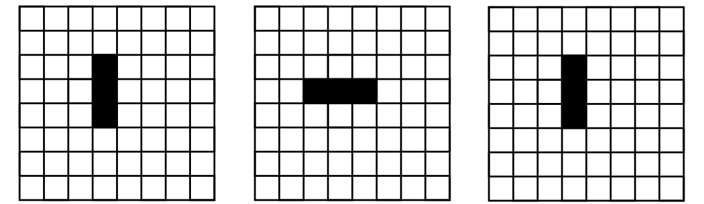

## Automaty komórkowe

Automaty komórkowe pokazują, jak proste reguły mogą generować skomplikowane zachowanie.

Pokażemy kilka przykładów z „Gry w życie” (Game of Life).
Reguły są takie, że na dwuwymiarowej planszy komórki mogą mieć dwa stany – być martwe albo żywe.
Żywa komórka pozostaje w następnym kroku nadal żywa, jeżeli ma obok siebie 2 albo 3 żywe komórki;
przy innej liczbie sąsiadów umiera. Martwa komórka ożyje w następnym kroku,
jeżeli ma obok siebie dokładnie 3 żywych sąsiadów.
Na rysunkach jest żywa komórka zaznaczona czarnym kolorem i martwa komórka białym.

Przykład 1. Prosty przykład ewolucji zmierzającej do stanu, w którym już się stan komórek nie zmienia:

1a) Struktury żywych komórek stopniowo znikają aż pozostanie puste pole:

1b) Dojdzie się do struktury, która się już nie zmienia:

Przykład 2. Proste struktury, które zmieniają się okresowo, i co pewien czas powracają do swojego stanu pierwotnego:

2a) Prawdopodobnie najprostsza okresowo zmieniająca się struktura:

2b) I jeszcze jedna trochę bardziej skomplikowana struktura, która się zmienia okresowo:

Jeżeli mamy do dyspozycji odpowiedni program, który nam pokaże sytuacje po podanej liczbie kroków,
możemy badać, jaki wpływ może mieć minimalna zmiana w początkowej konfiguracji.

Na przykład jeżeli w początkowej konfiguracji w 2b przesuniemy jedno pole o kilka miejsc,
wówczas ze struktury, która się co kilka kroków powtarzała, rozpocznie się niespodziewana ewolucja:

Stan początkowy (w konfiguracji z 2b przesunęliśmy jedno pole o kilka miejsc:

Stan po 71 krokach:

Stan po 80 krokach:

Stan po 409 krokach:

Stan po 730 krokach:

Widać tu, że zmiana tylko jednego pola może prowadzić do powstania dużej liczby nowych struktur,
które mogą być znacznie skomplikowane i całkowicie różniące się od początkowej struktury.
