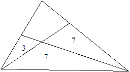

## Zadania matematyczno-logiczne

Zadanie 1:

Jeżeli półtora kury w ciągu półtora dnia zniesie półtora jajka, to ile jajek zniesie 9 kur w ciągu 9 dni?

Zadanie 2:

Jaka jest następna liczba w ciągu liczbowym

246,56,61,37,58,89,145,42,?

Zadanie 3:

Ile wynosi pole całego trójkąta, jeżeli pola jego części wynoszą tyle, jak zaznaczono na rysunku?

